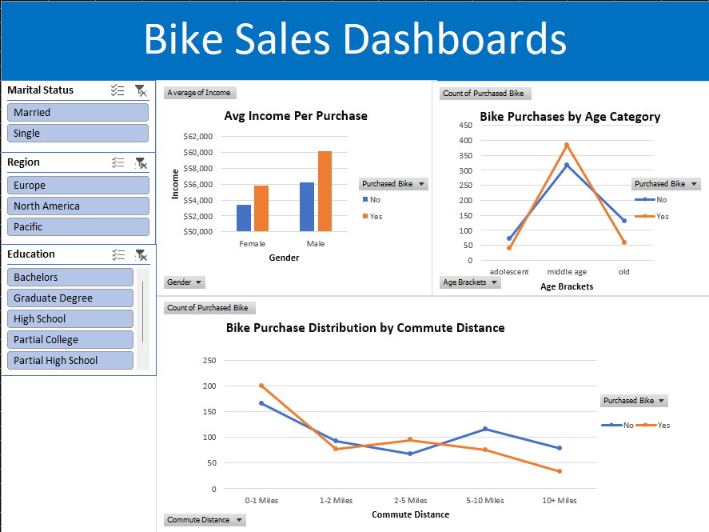

# Bike Sales Analysis Dashboard (Excel)

## Project Overview

This project analyzes a bike sales dataset using Microsoft Excel and presents key business insights through an interactive dashboard. The dashboard helps identify patterns in customer purchasing behavior based on demographics, income, commute distance, and age groups.

## Objectives

- Clean and prepare the dataset for analysis.
- Explore customer demographics and purchasing trends.
- Create interactive visualizations using Excel.
- Build a dashboard to support data-driven decision-making.

## Tools Used

- Microsoft Excel
- Data Cleaning
- Pivot Tables
- Pivot Charts
- Slicers
- Dashboard Design

## Dataset

The dataset contains customer information such as:

- Age
- Gender
- Income
- Marital Status
- Education
- Occupation
- Commute Distance
- Region
- Bike Purchase Status

File:
- `Dataset.xlsx`

## Dashboard Features

The dashboard includes visualizations for:

- Bike Purchase by Age Bracket
- Bike Purchase by Gender
- Bike Purchase by Commute Distance
- Income Analysis of Bike Buyers
- Interactive Filtering using Slicers

## Dashboard Preview

## Files Included

| File Name | Description |
|------------|------------|
| Bike Sales Dashborads.xlsx | Interactive Excel dashboard |
| Dataset.xlsx | Original dataset used for analysis |
| dashboard_screenshot.png | Dashboard preview image |

## Key Insights

- Middle-aged customers showed higher bike purchase rates.
- Customers with shorter commute distances were more likely to purchase bikes.
- Income levels influenced purchasing decisions.
- Demographic factors such as age and gender revealed noticeable purchasing patterns.

## How to Use

1. Download the repository.
2. Open `Bike Sales Dashborads.xlsx` in Microsoft Excel.
3. Use the slicers to interact with the dashboard.
4. Explore the visualizations and insights.

## Author

**Vansh**

Aspiring Data Analyst | Data Science Enthusiast

---

If you found this project useful, feel free to star the repository.
